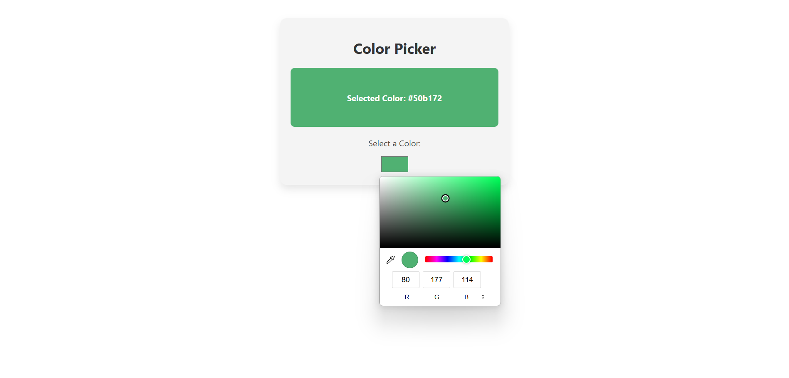

# Color Picker App

A simple React application that allows users to pick a color using a color input and displays the selected color.

## Screenshot



## Features

- Interactive color picker input
- Displays the selected color code and a preview box
- Responsive and clean UI with modern styling

## Getting Started

### Prerequisites

- [Node.js](https://nodejs.org/) (v16 or higher recommended)
- [npm](https://www.npmjs.com/) (comes with Node.js)

### Installation

1. Clone the repository:
   ```sh
   git clone https://github.com/GranthSidhant/color_picker_app.git
   cd color_picker_app